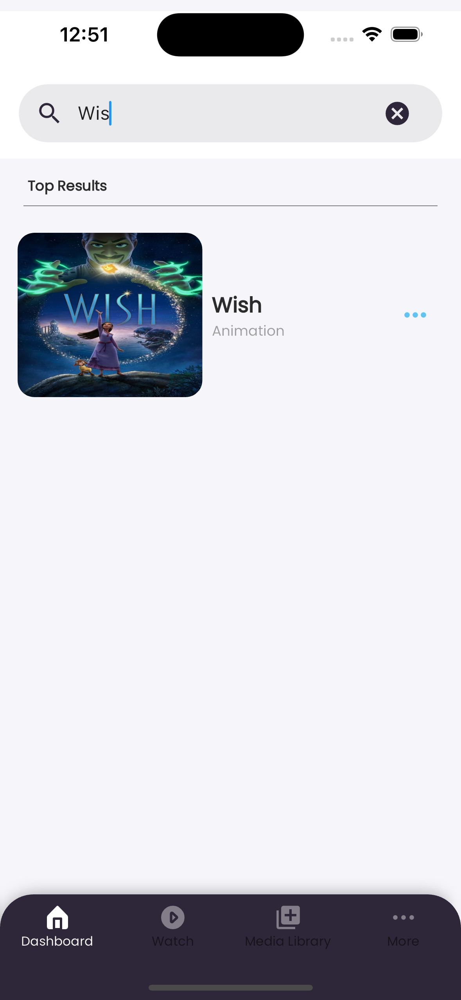
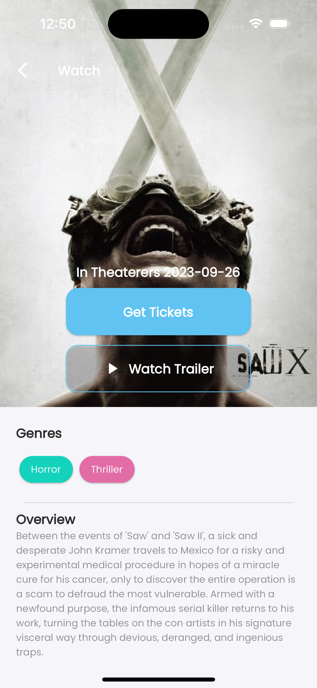
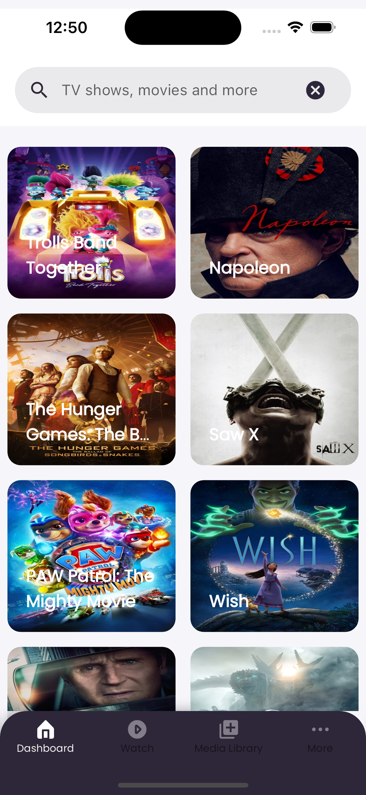

# Flutter Movie App

This Flutter app lists upcoming movies using The Movie Db API (TMdb) and allows users to navigate to book movie tickets.

## Features

- Upcoming movies listing
- Movie details including trailers
- Watch movie trailers functionality

## Dependencies

- [Dio](https://pub.dev/packages/dio) for HTTP requests
- [Hive](https://pub.dev/packages/hive) for caching
- [Stacked](https://pub.dev/packages/stacked) for state management
- [youtube_player_flutter](https://pub.dev/packages/youtube_player_flutter) for playing YouTube videos
- [cache_network_image](https://pub.dev/packages/cached_network_image) for caching images
- [flutter_staggered_animations](https://pub.dev/packages/flutter_staggered_animations) for staggered animation of listviews and gridviews
- [shimmer](https://pub.dev/packages/shimmer) for shimmer loading effect
- [dio_cache_interceptor](https://pub.dev/packages/dio_cache_interceptor) for caching api responses
- [flutter_screenutil](https://pub.dev/packages/flutter_screenutil) to manage responsiveness
- [awesome_dio_interceptor](https://pub.dev/packages/awesome_dio_interceptor) for logging

## Screenshots


*Upcoming Movies Screen*


*Movie Details Screen*


*Movie Details Screen Grid*


*Search Screen*

## Installation

1. Clone the repository:

   ```bash
   git clone https://github.com/yourusername/your-flutter-movie-app.git
